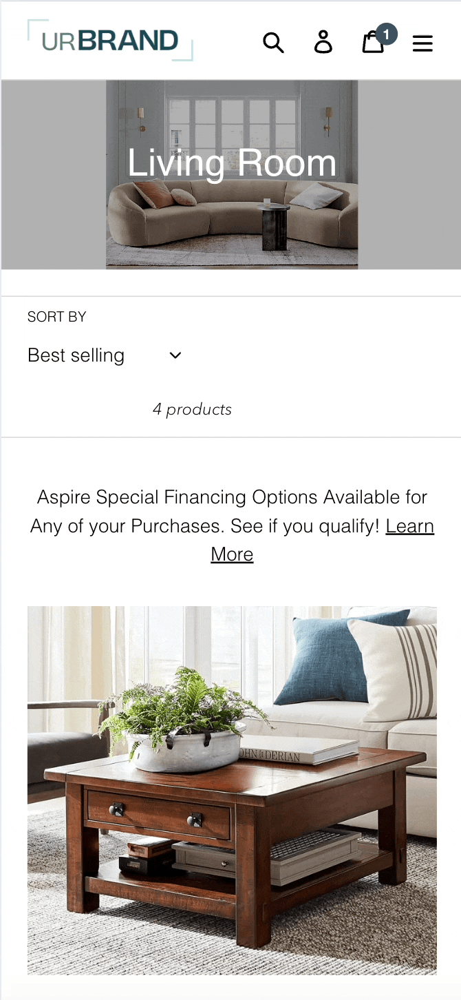
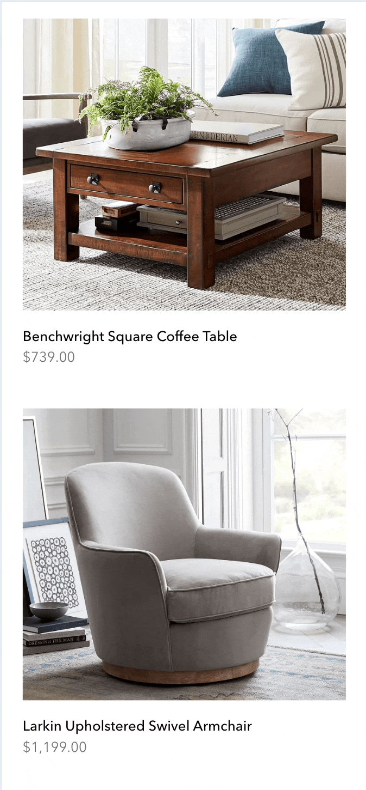
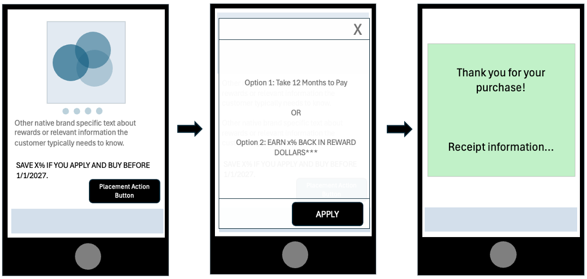
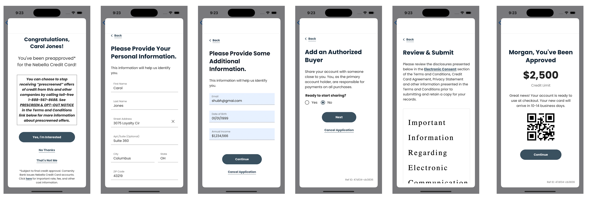
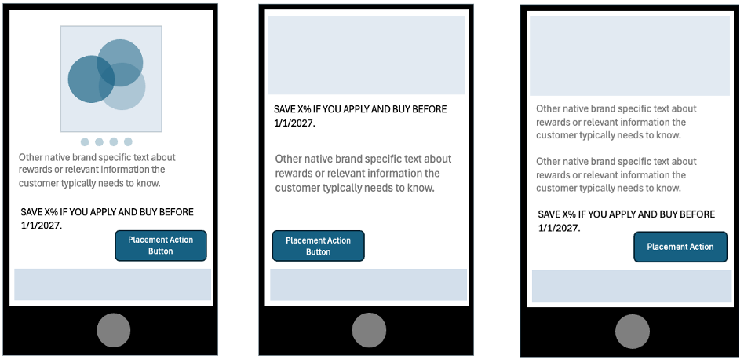
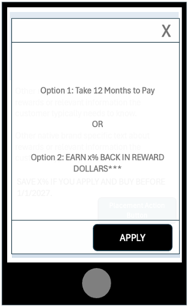
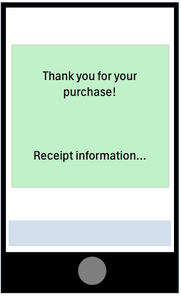

<p align="center">
  &nbsp;&nbsp;&nbsp; &nbsp;&nbsp;&nbsp;

</p>

# **Bread Partners SDK – Android Library**
[](https://jitpack.io/#getbread/breadfinancial-brand-partners-android)

## **Overview of the Bread Financial Brand Partners SDK – Apply and Buy**

The **Bread Financial Brand Partners Mobile Software Development Kit** (“SDK”) allows our Brand Partners to integrate **“Apply and Buy”** functionality within their app by using **User Interface** (“UI”) placements and a **Web View**. This functionality provided by the SDK will allow a customer to apply for credit to make a purchase within a brand partner’s native mobile app.

---

## Mobile SDK – High Level Procedural Steps

The Android Mobile SDK allows you to utilize placement text, and an actionable button associated with the placement text. The button will then flow into the next stage of the process where a customer can apply for credit via a Web View that the mobile SDK makes available to complete the application. After a successful application and approval, a token will then be returned to the native mobile app to complete the checkout payment process.

<p align="center">
  
</p>

---

## Android Mobile SDK Minimum Requirements

Ensure you have the following tools installed:

- **Android Studio (Jellyfish | 2023.3.1 or newer)**
- **Kotlin (Kotlin Compiler Version 1.9.22 or newer)e**

---

### Access The Bread Financial Brand Partners SDK

Currently, the **Brand Partners SDK** will be available only for brand partners that are part of the initial pilot group. It will be distributed directly to the brand partner’s identified technical resource.

### App Store Privacy and Compliance

We are committed to ensuring that our dependency in your app does not become your problem. We will make Apple and Google compliance and privacy changes as soon as the requirements are made publicly available so we can release an updated SDK to you as soon as possible.

### Bug Support

Please contact us at **BreadFinancialMobileSupport@breadfinancial.com** to let us know about any issues you encounter, along with a detailed description of what you encountered, what you are seeing in your mobile app analytics/logs, or any stack trace that you may have available.

### Sample App

A sample app will be provided with the SDK so that you can see the SDK in action, along with placement samples, and get the SDK integrated quicker.

### What’s New?

You can find a history of our changes in the SDK **[here](https://github.com/getbread/breadfinancial-brand-partners-android/blob/master/CHANGELOG.md)**.

We will provide a brief description of what issues were fixed and what new capabilities are enabled for consumption.

---

# Implementing the Bread Financial Mobile SDK

## High Level Overview of the SDK Process

- Implement the Brand Partners SDK via Gradle/AAR
- Initialize the SDK
- Make a placement request and render the placement
- Implement placement callback logic
- After callback custom logic is implemented proceed to application and financing options within the Web View object
- If credit is granted, an authorization token object will be returned from the Web View to be consumed and used at checkout for payment.

---

## Integrate Android Mobile SDK via Gradle

#### a. To integrate BreadPartnersSDK into your Android Studio project, add it as a Gradle dependency.
```groovy
implementation 'com.github.getbread:breadfinancial-brand-partners-android:<Ref>' 
```
Replace <Ref> with the reference you want to use. The <Ref> can be:
- Commit Hash
- Tag Version
- Branch Name

#### b, In your `settings.gradle.kts`, add the JitPack repository inside `dependencyResolutionManagement:`
```groovy
dependencyResolutionManagement {
    repositories {
        // Other repositories...
        
        maven { url = uri("https://jitpack.io") }

        // Other repositories...
    }
}
```

#### c. Select the appropriate version (or branch) for your project.
```renderscript
./gradlew -refresh-dependencies
```

#### d, Import the `BreadPartnersSDK` to whichever class you need to utilize the SDK in:

```markdown
import com.breadfinancial.breadpartners.sdk.core.BreadPartnersSDK
```

---

## Initiating the SDK

Call the setup function at the app launch to initialize the SDK with the required configuration,

- `integrationKey` must be provided to identify the brand.
- `environment` determines whether the SDK runs in development or production.
- `enableLog` flag controls logging for debugging.

```markdown
BreadPartnersSDK.getInstance().setup(
    environment = BreadPartnersEnvironment.STAGE,
    enableLog = true,
    integrationKey = brandID,
    application = application
)
```

---

## Making a Placement Request

To register a placement, you need to configure the placement data, UI styling, and merchant details before making the API request.

### 1. Define Placement Data

Create a `PlacementData` object to specify the financing type, order details, and placement ID. This includes subtotal, discounts, total price, shipping, tax, discount codes, and pickup information like name, phone, address, and email.

```markdown
val placementData = PlacementData(
    financingType = BreadPartnersFinancingType.INSTALLMENTS,
    locationType = BreadPartnersLocationType.CATEGORY,
    placementId = placementID,
    domID = "123",
    order = Order(
        subTotal = CurrencyValue(currency = "USD", value = 0.0),
        totalDiscounts = CurrencyValue(currency = "USD", value = 0.0),
        totalPrice = CurrencyValue(currency = "USD", value = price.toDouble()),
        totalShipping = CurrencyValue(currency = "USD", value = 0.0),
        totalTax = CurrencyValue(currency = "USD", value = 0.0),
        discountCode = "string",
        pickupInformation = PickupInformation(
            name = Name(
                givenName = "John",
                familyName = "Doe"
            ),
            phone = "+14539842345",
            address = BreadPartnersAddress(
                address1 = "156 5th Avenue",
                locality = "New York",
                postalCode = "10019",
                region = "US-NY",
                country = "US"
            ),
            email = "john.doe@gmail.com"
        ),
        fulfillmentType = "type",
        items = emptyList()
    )
)
```

### 2. Configure

Pass the `placementData` inside a `PlacementConfiguration` object.

```markdown
val placementsConfiguration = PlacementsConfiguration(
    placementData = placementData
)
```

### 3. Set Up Merchant Information

Define the merchant and buyer details in `MerchantConfiguration`. This includes buyer information like name, birth date, email, phone, billing address, and optional shipping address. It also contains merchant-related data like store number, channel, and subchannel.

```markdown
val merchantConfiguration = MerchantConfiguration(
    buyer = BreadPartnersBuyer(
        givenName = "Jack",
        familyName = "Seamus",
        additionalName = "C.",
        birthDate = "1974-08-21",
        email = "johncseamus@gmail.com",
        phone = "+13235323423",
        billingAddress = BreadPartnersAddress(
            address1 = "323 something lane",
            address2 = "apt. B",
            country = "USA",
            locality = "NYC",
            region = "NY",
            postalCode = "11222"
        ),
        shippingAddress = null
    ),
    loyaltyID = "xxxxxx",
    storeNumber = "1234567",
    channel = "P",
    subchannel = "X"
)
```

### 4. Register the Placement

Call the registerPlacements method with the configured merchantConfiguration and placementsConfiguration. The splitTextAndAction flag determines how the text content is processed.

- `merchantConfiguration`: Provide user account details in this configuration.
- `placementsConfiguration`: Specify the pre-defined placement details required for building the UI.
- `splitTextAndAction`: Set this to true if you want the placement to return either text with a link or a combination of text and button.
- `callback`: A function that handles user interactions and ongoing events related to the placements.

```markdown
BreadPartnersSDK.getInstance().registerPlacements(
    merchantConfiguration = merchantConfiguration,
    placementsConfiguration = placementsConfiguration,
    viewContext = this,
    splitTextAndAction = true
) { breadPartnerEvent ->

}
```

## Making a RTPS Request

To check if a user qualifies for a pre-screen card application, the brand partner's application needs to call the silentRTPSRequest method from the SDK. This process is completely silent, meaning there will be no visible UI changes for the user. The brand partner is only required to send the necessary metadata while the SDK handles the entire flow internally.

If any step in the RTPS (Real-Time Pre-Screen) flow fails, the user experience will remain unchanged, and no UI updates will be triggered. However, if the RTPS check succeeds, the SDK will invoke a callback, allowing the brand partner to display a popup with the "Approved" flow. The brand partner should listen for this callback and present the approval UI accordingly.

### 1. Define RTPS Data

Create a RTPSData object to specify the location type, order details, and mockResponse type. Order includes subtotal, discounts, total price, shipping, tax, discount codes, and pickup information like name, phone, address, and email.

```markdown
val rtpsData = RTPSData(
    locationType = BreadPartnersLocationType.CHECKOUT,
    order = Order(
        totalPrice = CurrencyValue(
            currency = "USD",
            value = 5000.0)
    ),
    mockResponse = BreadPartnersMockOptions.SUCCESS
)
```

### 2. Configure UI & Styling:

Pass the placementData inside a PlacementConfiguration object.

```markdown
val placementsConfiguration = PlacementsConfiguration(
    rtpsData = rtpsData
)
```

### 3. Set Up Merchant Information

Define the merchant and buyer details in MerchantConfiguration. This includes buyer information like name, birth date, email, phone, billing address, and optional shipping address. It also contains merchant-related data like store number, channel, and subchannel.

```markdown
val merchantConfiguration = MerchantConfiguration(
    buyer = BreadPartnersBuyer(
        givenName = "Jack",
        familyName = "Seamus",
        additionalName = "C.",
        birthDate = "1974-08-21",
        email = "johncseamus@gmail.com",
        phone = "+13235323423",
        billingAddress = BreadPartnersAddress(
            address1 = "323 something lane",
            address2 = "apt. B",
            country = "USA",
            locality = "NYC",
            region = "NY",
            postalCode = "11222"
        ),
        shippingAddress = null
    ),
    loyaltyID = "xxxxxx",
    storeNumber = "1234567",
    channel = "P",
    subchannel = "X"
)
```

### 4. Make the RTPS call

Call the silentRTPSRequest method with the configured merchantConfiguration and placementsConfiguration.

- `merchantConfiguration`: Provide user account details in this configuration.
- `placementsConfiguration`: Specify the pre-defined placement details required for building the UI.
- `splitTextAndAction`: Set this to true if you want the placement to return either text with a link or a combination of text and button.
- `callback`: A function that handles user interactions and ongoing events related to the placements.

```markdown
BreadPartnersSDK.getInstance().silentRTPSRequest(
    merchantConfiguration = merchantConfiguration,
    placementsConfiguration = placementsConfiguration,
    viewContext = this
) { breadPartnerEvent ->

}
```

### Flow Illustration.
<p align="center">
  
</p>

--- 

## Callback Event Types

The following is a list of callback events from the Register Placement and RTPS function:

```markdown
/// Renders a text view containing a clickable hyperlink.
/// - Parameter spannableText: A Spannable object containing the text with a clickable link.
data class RenderTextViewWithLink(val spannableText: Spannable) : BreadPartnerEvent()

/// Renders text and a button separately on the screen.
/// - Parameters:
///   - textView: A TextView for displaying text.
///   - button: A Button for user interactions.
data class RenderSeparateTextAndButton(val textView: TextView, val button: Button) : BreadPartnerEvent()

/// Displays a popup interface on the screen.
/// - Parameter dialogFragment: A DialogFragment that presents the popup.
data class RenderPopupView(val dialogFragment: DialogFragment) : BreadPartnerEvent()

/// Detects when a text element is clicked.
/// This allows brand partners to trigger any specific action.
object TextClicked : BreadPartnerEvent()

/// Detects when an action button inside a popup is tapped.
/// This provides a callback for brand partners to handle the button tap.
object ActionButtonTapped : BreadPartnerEvent()

/// Provides a callback for tracking screen names, typically for analytics.
/// - Parameter name: The name of the current screen.
data class ScreenName(val name: String) : BreadPartnerEvent()

/// Provides a success result from the web view, such as approval confirmation.
/// - Parameter result: The result object returned on success.
data class WebViewSuccess(val result: Any) : BreadPartnerEvent()

/// Provides an error result from the web view, such as a failure response.
/// - Parameter error: The error object detailing the issue.
data class WebViewFailure(val error: Throwable) : BreadPartnerEvent()

/// Detects when the popup is closed at any point and provides a callback.
object PopupClosed : BreadPartnerEvent()

/// Provides information about any SDK-related errors.
/// - Parameter error: The error object detailing the issue.
data class SdkError(val error: Throwable) : BreadPartnerEvent()

/// Provides information about any Card-related status.
/// - Parameter status: object detailing the status.
data class cardApplicationStatus(val status: Any) : BreadPartnerEvent()

/// Logs requests, responses, errors, and successes.
data class OnSDKEventLog(val log: Any) : BreadPartnerEvent()
```

## Examples of dealing with Register Placement Callbacks

### 1. Render a TextView in UIKit

```markdown
is BreadPartnerEvent.RenderTextViewWithLink -> {

    /**
     * Handles rendering of a text view with a clickable link.
     *
     * - Modifies the font, text color, and link color for the text view.
     * - Adds the text view to the main view and sets up its layout constraints.
     */

    val textView = binding.textView

    val spannable = event.spannableText

    val clickableSpans =
        spannable.getSpans(0, spannable.length, ClickableSpan::class.java)
    val normalTextEndIndex =
        clickableSpans.firstOrNull()?.let { spannable.getSpanStart(it) } ?: 0

    spannable.apply {
        setSpan(
            ForegroundColorSpan(Color.BLACK),
            0,
            normalTextEndIndex,
            Spannable.SPAN_EXCLUSIVE_EXCLUSIVE
        )
        setSpan(
            AbsoluteSizeSpan(17, true),
            0,
            normalTextEndIndex,
            Spannable.SPAN_EXCLUSIVE_EXCLUSIVE
        )

        setSpan(
            ForegroundColorSpan(Color.parseColor(primaryColor)),
            normalTextEndIndex,
            spannable.length,
            Spannable.SPAN_EXCLUSIVE_EXCLUSIVE
        )

        setSpan(
            AbsoluteSizeSpan(17, true),
            normalTextEndIndex,
            spannable.length,
            Spannable.SPAN_EXCLUSIVE_EXCLUSIVE
        )
    }

    textView.text = spannable
    textView.typeface = customFont
    textView.movementMethod = LinkMovementMethod.getInstance()
}
```

### 2. Render a Popup View in UIKit

```markdown
is BreadPartnerEvent.RenderPopupView -> {

    /**
     * Handles rendering of a popup view.
     *
     * Example:
     * Implement some process prior to loading the WebView popup
     * (e.g., checking if the customer is authenticated).
     */
    val view = event.dialogFragment
    showYesNoAlert(this) { userConfirmed ->
        if (userConfirmed) {
            view.show(this.supportFragmentManager, "PopupDialog")
        } else {
            println("User canceled No")
        }
    }
}
```

## Register Placement Customization (Styling and display)

To give you flexibility in the layout that you use your placements in, you can request up to two UI objects – a `TextView` and a `Button`.

The text associated with the placement request. `(TextView)`

The action button associated the placement request. `(Button)`

### Flexibility for various layouts.

<p align="center">
  
</p>

--- 

## View Fragment (Web View)

The `renderPopupView` callback provides a `DialogFragment` instance from the SDK, which renders a WebView inside it. This **View Fragment** is designed to display where the customer can apply for credit within your native mobile app.

The SDK returns this `DialogFragment` instance to the app, allowing the app to present the popup. The View Fragment also includes its own set of event callbacks for handling interactions.

### Popup View.

<p align="center">
  
</p>

### The View Fragments (Web View) Callbacks are listed below:

```markdown
BreadPartnerEvent.ActionButtonTapped -> {
    print("BreadPartnerSDK::Popup action button was tapped!")
}

is BreadPartnerEvent.ScreenName -> {
    val name = event.name
    print("BreadPartnerSDK::Screen name: ${name}")
}

is BreadPartnerEvent.WebViewSuccess -> {
    val result = event.result
    print("BreadPartnerSDK::WebView success with result: ${result}")
}

is BreadPartnerEvent.WebViewFailure -> {
    val error = event.error
    print("BreadPartnerSDK::WebView interaction failed with error: ${error}")
}

BreadPartnerEvent.PopupClosed -> {
    print("BreadPartnerSDK::Popup closed!")
}
is BreadPartnerEvent.CardApplicationStatus -> {
    val status = event.status
    print("BreadPartnerSDK::Card Application Status: ${status}")
}
is BreadPartnerEvent.SdkError -> {
    val error = event.error
    print("BreadPartnerSDK::SDK encountered an error: ${error}")
}
```

## Customer Application Status Event

To understand if the customer has been approved, declined, etc. you will have to listen to the Credit Application Status event callback.

The responses available for the Credit Application Status are:
- `APPROVED`
- `PENDING`
- `ACCOUNT_EXISTS`
- `DECLINED`
- `ERROR`

## Approved Credit Application Response Object

The response object that you receive from the SDK View Fragment event callback once a customer has been approved looks like the example below:

```json
{
  "alternativePhone": "undefined",
  "applicationId": "516495689845349",
  "callId": "14766ff59402a765be2ffb714766ff59402a765be2ffb714766ff59402a765be2ffb714766ff59402a765be2ffb7",
  "cardType": "PL",
  "emailAddress": "shubh@gmai.com",
  "message": "Application successfully approved",
  "mobilePhone": "6143436666",
  "result": "APPROVED",
  "rewards": "undefined",
  "status": 200
}
```

## Token Usage at Checkout

Once the customer has been approved for credit and you have received the token object via the Web View callback event, you can then complete the transaction by making an account lookup up request through the SDK. The Account Lookup request will then provide you with the actual card information used during authorization.

<p align="center">
  
</p>

---
